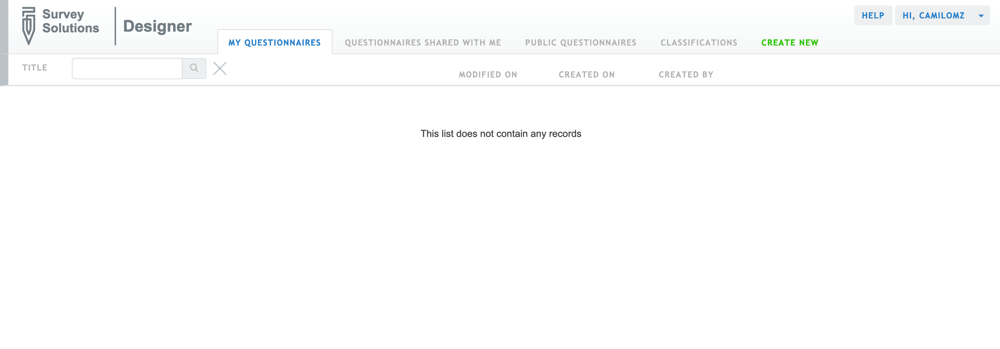
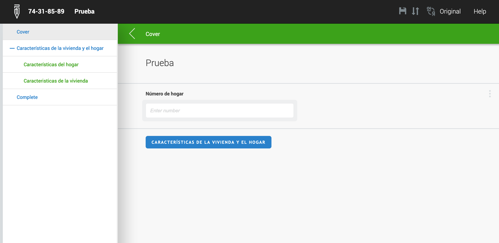

# **Survey Solutions desde cero: Creando encuestas profesionales.**

## **¿Qué es Survey Solutions?**

Survey Solutions es un software gratuito desarrollado por el Banco Mundial para **recolección de datos en campo a través de cuestionarios digitales** aplicables con cualquier dispositivo móvil. Es una plataforma que contiene diferentes herramientas para diseñar, probar y aplicar encuestas de todo tipo. Las herramientas que integran el ecosistema de Survey Solutions son: Designer, Tester, Headquarters e Interviewer. Ya que el objetivo de este artículo es enseñarte cómo diseñar y probar tu propio cuestionario, nos enfocaremos principalmente en **Designer**.

## **Survey Solutions Designer**

Designer es la herramienta de Survey Solutions con la que se diseña el cuestionario. Es aquí donde se agregan todas las secciones y preguntas de la encuesta. Además, cuenta con una serie de opciones que permiten hacer **control de calidad de los datos:** como reglas de validación y condiciones habilitantes, de las que se hablará más adelante.

### **Registrarse**

Lo primero a saber es que Designer es una herramienta online y puedes acceder a ella [aquí](https://designer.mysurvey.solutions/Identity/Account/Login?ReturnUrl=%2F).

  

Para registrarte en la plataforma sólo es necesario hacer click en “Registrar” o “Register” y llenar la información que se solicita (en el espacio “Login” poner un nombre de usuario). Una vez que hayas llenado la información, recibirás un correo de confirmación y luego podrás acceder.

### **Pantalla principal**

Después de ingresar tu nombre de usuario y contraseña, aparece la pantalla principal. En ella se muestran los menús de **“My questionnaires”**, que muestra una lista de todos los cuestionarios que hemos creado (nos aparecerá en blanco porque no hemos creado ninguno); **“Questionnaires shared with me”** que muestra una lista de cuestionarios creados por alguien más y que nos hayan compartido; **“Public questionnaires”** donde podremos encontrar ejemplos de cuestionarios de diferentes tipos que han sido creados por el equipo de Survey Solutions y usuarios avanzados para que puedan ser usados como base por los usuarios menos experimentados; **“Classifications”** que nos facilita grupos de preguntas que son comúnmente usadas en diferentes tipos de cuestionario, según su temática; y por último, la opción de **“Create new”** que es con la que podemos comenzar a diseñar nuestro cuestionario.

  

### **Crear un cuestionario / Create new**

Al hacer clic en “CREATE NEW” nos aparecerá una ventana donde pondremos el título y el nombre de la variable para el cuestionario. Después de seleccionar un título y un nombre de variable, podemos comenzar. 

  

El nombre de variable es sólo el nombre que tendrá el archivo (no debe contener espacios) una vez que hayamos hecho la recolección de datos y exportemos nuestra base de datos. Al hacer esto, entraremos al menú principal de diseño del cuestionario.

  

En esta pantalla podemos ver que tenemos la opción de agregar diferentes elementos al cuestionario, que son:

*   Secciones (en el menú de 3 líneas horizontales de la izquierda)
*   Preguntas / Add question
*   Subsecciones / Add sub-section
*   Rosters
*   Variables / Add varible
*   Texto estático / Add static text

Vamos a hablar ahora sobre qué es cada uno, qué elementos tienen y para qué sirven.

### **Crear una pregunta**

_La parte más importante de todo cuestionario son las preguntas._ Para crear una pregunta, sólo debemos dar clic en **“add question”**. Al hacer esto, vamos a ver una serie de espacios para llenar. Lo primero que hay que hacer es seleccionar el **tipo de pregunta**, ya que algunas de las demás opciones van a variar en dependencia de esto. Designer nos permite escoger entre **11 diferentes tipos de pregunta** (ver imagen abajo): Categórica, de selección única y de selección múltiple, numérica, fecha, texto, GPS, lista, código de barra, foto, audio y mapas. En esta entrada vamos a enfocarnos en los tipos de pregunta más esenciales y comúnmente utilizadas.

  

Lo siguiente que debemos hacer es escribir el **nombre de la variable** (variable name), que es el que aparecerá en la base de datos una vez que hayamos hecho nuestra encuesta y exportado los datos. Escribimos también la **etiqueta** (variable label), que es una descripción de lo que esa variable va a contener en la base de datos, y escribimos el **texto de la pregunta** (questions text). El texto de la pregunta puede contener la respuesta de alguna pregunta anterior, escribiendo el nombre de variable de esa pregunta entre signos porcentuales (%). Vamos a crear 7 preguntas nuevas, con las que comenzaremos a formar nuestro cuestionario de prueba. 

En el siguiente video podrás ver una demostración de inicio a fin de la elaboración de la encuesta que se usará como ejemplo. Te recomendamos que antes de seguir leyendo esto, repliques todo lo que aparece en el video para que puedas seguir lo que vamos a explicar. Creemos que si replicas todo el video primero podrás tener una idea general del funcionamiento de Designer que luego iremos ahondando.

Una vez que termines de replicar el video, tendrás una vista como esta, donde el tipo de la pregunta está indicado por un símbolo al lado izquierdo del nombre de la pregunta y en verde al lado derecho aparece el nombre de la variable que hemos colocado para esa pregunta.

  

A continuación, para las preguntas de selección (única o múltiple), se debe escribir las opciones de respuesta con su respectivo valor. Este valor es el que va a tener la variable en la base de datos. En el caso de nuestro ejemplo, la pregunta sobre el **tipo de vivienda** es una pregunta de selección única. Vamos a asignarle las categorías de respuesta: **1, Casa; 2, Apartamento; 3, Cuarto; 4, Rancho o choza; 5, Vivienda improvisada.** En la siguiente imagen podemos ver que estas categorías ya fueron creadas.

  

Al crear variables numéricas también es posible definir **valores específicos de respuesta**, usando la opción de “special values”. Esto se usa para cuando se tiene que escribir que no sabe o no responde en preguntas numéricas como la edad o los ingresos. También para las preguntas numéricas debemos especificar si queremos que la respuesta sea **solo en números enteros o que admita decimales**, usando la casilla de “integer”. Para nuestro ejemplo, vamos a colocar el valor 99 para indicar que “No sabe” para las preguntas numéricas: **personas que habitan en la vivienda, miembros del núcleo familiar, cuartos de la vivienda** y **dormitorios de la vivienda.** Igualmente para todas ellas vamos a indicar que se trata de números enteros, marcando la casilla “integer”, tal como se muestra en la siguiente imagen.

  

Ahora vamos a hablar de las opciones para control de calidad de datos. Éstas son las **condiciones habilitantes** (enabling condition) y las **condiciones de validación** (add new validation rule). Estas opciones están disponibles para cualquier pregunta, sin importar el tipo. Las condiciones habilitantes sirven para preguntas que sólo queremos que sean respondidas en algunos casos (por ejemplo: mostrar pregunta 8 sólo si la respuesta anterior es “Sí”). Las condiciones de validación sirven para limitar la respuesta que se puede dar a una pregunta y así evitar que se ingresen respuestas incorrectas por error o respuestas que no tengan sentido. En la imagen se muestra el espacio donde podemos escribir estas condiciones. Designer permite agregar hasta un máximo de 10 condiciones de validación para cada pregunta.

  

Para poder usar cualquiera de estas dos opciones, es necesario escribir una regla que le indica a la plataforma qué condiciones se deben cumplir, ya sea para que la pregunta aparezca o no, en el caso de los flujos, o para determinar qué respuestas son válidas y cuáles no, en el caso de las condiciones de validación. Para escribir estas reglas, Designer usa el lenguaje de programación C#, pero no es necesario tener un conocimiento avanzado de este lenguaje para poder escribir la mayoría de las reglas que podemos necesitar en un cuestionario. A continuación, vamos a explicar algunas de las funciones más esenciales que se necesita conocer para poder escribir estas reglas, y luego escribiremos algunas reglas para nuestro cuestionario de prueba.

### **Funciones aritméticas**

Al escribir las reglas podemos usar las funciones aritméticas básicas: suma, resta, multiplicación, división, igualdad, desigualdad, menor que, mayor que.

<table>
  <tr>
   <td>Operador
   </td>
   <td>Descripción
   </td>
   <td>Ejemplo
   </td>
  </tr>
  <tr>
   <td>+
   </td>
   <td>Devuelve la suma de 2 o más valores
   </td>
   <td>[pregunta1] + [pregunta2]
   </td>
  </tr>
  <tr>
   <td>-
   </td>
   <td>Devuelve la diferencia entre 2 o más valores
   </td>
   <td>[pregunta1] - [pregunta2]
   </td>
  </tr>
  <tr>
   <td>*
   </td>
   <td>Devuelve la multiplicación de 2 o más valores
   </td>
   <td>[pregunta1] * [pregunta2]
   </td>
  </tr>
  <tr>
   <td>/
   </td>
   <td>Devuelve el cociente entre 2 o más valores
   </td>
   <td>[pregunta1] / [pregunta2]
   </td>
  </tr>
  <tr>
   <td>==
   </td>
   <td>Comprueba que dos valores sean iguales
   </td>
   <td>[pregunta1] == [pregunta2]
   </td>
  </tr>
  <tr>
   <td>!=
   </td>
   <td>Comprueba que dos valores sean diferentes
   </td>
   <td>[pregunta1] != [pregunta2]
   </td>
  </tr>
  <tr>
   <td>&lt;
   </td>
   <td>Comprueba que un valor sea menor que otro
   </td>
   <td>[pregunta1] &lt; [pregunta2]
   </td>
  </tr>
  <tr>
   <td>>
   </td>
   <td>Comprueba que un valor sea mayor que otro
   </td>
   <td>[pregunta1] > [pregunta2]
   </td>
  </tr>
  <tr>
   <td>&lt;=
   </td>
   <td>Comprueba que un valor sea menor o igual que otro
   </td>
   <td>[pregunta1] &lt;= [pregunta2]
   </td>
  </tr>
  <tr>
   <td>>=
   </td>
   <td>Comprueba que un valor sea mayor o igual que otro
   </td>
   <td>[pregunta1] >= [pregunta2]
   </td>
  </tr>
</table>

Ahora apliquemos esto a nuestro cuestionario.

  

Tal como se muestra en la imagen, vamos a escribir para la pregunta sobre **cuántos cuartos de la vivienda usa su núcleo familiar**, una condición habilitante (enabling condition): **Núcleos &lt; Residentes**. Ésta regla le indica a Designer que la pregunta sólo se muestre si hay más de un núcleo familiar en la vivienda (por ejemplo, cuando una persona vive con su esposa e hijos y comparte casa con su hermana y su esposo) porque de lo contrario esta pregunta no tendría sentido. También, vamos a escribir una regla de validación: **Dormitorios &lt;= Cuartos.** Ésta regla le indica a Designer que el número de cuartos que usa ese núcleo familiar debe ser menor o igual que el número de cuartos que hay en total en la vivienda. También vamos a escribir el mensaje de error que se mostrará si se trata de ingresar una respuesta que no cumpla con esta regla al llenar la encuesta. El mensaje que vamos a escribir también se muestra en la imagen 10.

#### **Funciones adicionales**

Estas son otras funciones que pueden usarse en combinación con las anteriores y que son muy útiles al diseñar cuestionarios.

<table>
  <tr>
   <td>Operador
   </td>
   <td>Descripción
   </td>
   <td>Ejemplo
   </td>
  </tr>
  <tr>
   <td>&&
   </td>
   <td>Operador “Y”: Comprueba que se cumpla la condición 1 y la condición 2.
   </td>
   <td>[pregunta1] == 1 && [pregunta2] !=2
   </td>
  </tr>
  <tr>
   <td>||
   </td>
   <td>Operador “O”: Comprueba que se cumpla la condición 1 o la condición 2.
   </td>
   <td>[pregunta1] == 1 || [pregunta2] !=2
   </td>
  </tr>
  <tr>
   <td>? :
   </td>
   <td>Operador condicional: Comprueba si se cumple una condición determinada. Si se cumple, devuelve un valor, de lo contrario, devuelve otro.
   </td>
   <td>[pregunta1] == 1 ? 

[pregunta2] ==2 : [pregunta2] !=2
   </td>
  </tr>
  <tr>
   <td>.InList()
   </td>
   <td>Comprueba que el valor esté dentro de una lista de valores específicos.
   </td>
   <td>[pregunta1].InList(1,2,3)
   </td>
  </tr>
  <tr>
   <td>.Contains()
   </td>
   <td>Comprueba que el valor contenga otro valor en específico (uso principalmente para preguntas de texto).
   </td>
   <td>[pregunta1].Contains(“palabra”)
   </td>
  </tr>
  <tr>
   <td>!
   </td>
   <td>Comprueba que la condición especificada <strong>no</strong> se cumpla.
   </td>
   <td>![pregunta1].InList(1,2,3)
   </td>
  </tr>
</table>

Continuemos con nuestro ejemplo. Ahora vamos a agregar una segunda regla de validación para la misma pregunta: **Vivienda == 3 ? Dormitorios==1 : Dormitorios>0**. Ésta regla indicará que, si el **tipo de vivienda** es **“Cuarto” (opción 3)**, el **número de cuartos que usa el núcleo encuestado** debe ser igual a 1, y de lo contrario debe ser siempre mayor que 0. En la imagen 10 podemos ver también el mensaje de error que se mostrará si se ingresa algún valor erróneo al llenar la encuesta.

Con esto, ya hemos creado todas las preguntas que va a tener nuestro cuestionario, pero antes de pasar al siguiente elemento del cuestionario, vamos a hablar de una última característica de las preguntas: el **alcance de la pregunta** (“Question Scope”). Esta opción, situada en la parte inferior derecha, sirve para indicar quién debe llenar esta pregunta. La mayoría de las preguntas de un cuestionario van a ser llenadas siempre por el/la encuestador/a, pero también es posible agregar preguntas que deba responder el/la supervisor/a, que estén ocultas, y más importante: **preguntas de identificación.** Las preguntas de identificación son las que sirven para distinguir un cuestionario de otro, como códigos, números de hogar, zona geográfica u otros similares. Es importante mencionar que todo cuestionario debe tener por lo menos una pregunta de identificación. En el caso de nuestro ejemplo, vamos a seleccionar la pregunta del **número de hogar** como pregunta de identificación, como se muestra en la imagen siguiente en la esquina inferior derecha.

  

### **Variables**

El segundo elemento del que vamos a hablar y que puede tener un cuestionario son las **variables**. Las variables son preguntas que están respondidas por defecto. Se usan para cálculos automáticos que no necesitamos preguntar. Las variables no se muestran cuando estemos llenando el cuestionario, sino que vamos a poder verlas cuando exportemos la base de datos. Hay varios tipos de variable, pero las que se usan más comúnmente, así como en este caso, son las “Long integer”, que son **variables numéricas**.

Un ejemplo concreto es el hacinamiento. Una forma de medir el hacinamiento es dividiendo el número de personas en una vivienda entre el número de cuartos que hay en la vivienda. Vamos a agregar a nuestro cuestionario de prueba una variable (Add Variable) que calcule el hacinamiento. Como ya tenemos la pregunta sobre **personas en el hogar** y sobre **cuartos en la vivienda**, solo tenemos que crear una variable que haga la división automáticamente, haciendo uso de las mismas funciones que vimos anteriormente.

Primero, hacemos clic en “**Add Variable**”, y luego indicamos el tipo de variable: **Long Integer**, el nombre de variable: **Hacinamiento**, la etiqueta de la variable: **Hacinamiento** y la expresión lógica: **Núcleo/Dormitorio.** En la siguiente imagen podemos ver el resultado.

  

### **Secciones**

Las **secciones** son la principal división a través de la cual se puede navegar el cuestionario, moviéndose de una a otra. Cada sección puede contener varias **subsecciones**, y cada subsección contiene un grupo de preguntas. También es posible que una sección no contenga ninguna subsección, sino solamente una cantidad de preguntas.

En nuestro ejemplo, vamos a notar que nuestras preguntas están ya dentro de una sección, llamada “**New Section”**. Esto es porque, como todo cuestionario debe tener por lo menos una sección, Designer ha creado automáticamente una sección cuando creamos nuestro cuestionario en blanco para que pudiéramos agregar preguntas dentro de ella. 

El nombre de la sección se puede cambiar haciendo clic en el nombre de la sección y en el menú de la derecha veremos que podemos cambiar el nombre y la etiqueta de la sección. Vamos a nombrar la sección: “**Características de la vivienda y el hogar**” y vamos a etiquetarla como: “**Seccion_1**”, tal como se muestra en la imagen.

  

Luego, vamos a crear dos subsecciones dentro de esta sección. Vamos a hacer clic en “Add Subsection”, y vamos a crear una subsección llamada “**Características del hogar**” y con la etiqueta “**sección_1_1”**. luego vamos a repetir este proceso para la segunda subsección, que tendrá el nombre “**Características de la vivienda**”, y la etiqueta “**Seccion_1_2**”.

Finalmente, vamos a colocar dentro de cada subsección las preguntas que corresponde. Para poner una pregunta dentro de una subsección, debemos arrastrarla usando el mouse, de modo que se alinee a la derecha de la subsección, de forma similar a una lista jerárquica (esto lo hacemos haciendo clic en al lado izquierdo del símbolo del tipo de pregunta, al pasar el cursor debe aparecer una cruz de cuatro fechas). Vamos a arrastrar las preguntas: **Número de hogar, Nombre de encuestador/a, residentes de la vivienda y miembros del núcleo familiar,** dentro de la subsección: **Características del hogar;** y vamos a arrastrar las preguntas **Tipo de vivienda, cuartos de la vivienda y cuartos del núcleo para dormir**, y nuestra variable de **Hacinamiento** dentro de la subsección **Características de la vivienda.** El resultado debería verse como se muestra en la siguiente imagen.

  

Es importante mencionar que las secciones y subsecciones, al igual que las preguntas, también pueden tener condiciones habilitantes, aunque en nuestro ejemplo no haremos uso de esta opción.

### **Rosters**

El siguiente elemento del que vamos a hablar son los **roster.** Los roster son similares a las subsecciones, en el sentido de que son **grupos de preguntas**, pero tienen un uso específico. Vamos a usarlos para los casos en que se quiere repetir varias veces una misma pregunta. Esto pasa, por ejemplo, cuando diseñamos una encuesta de hogar. En las encuestas de hogar hay algunas preguntas que sólo necesitamos hacerlas una vez, como el tipo de vivienda o el número de miembros del hogar. Pero hay otras preguntas que necesitan preguntarse a cada miembro del hogar, como el sexo o la edad. En estos casos, debemos poner todas las preguntas que vayan a repetirse dentro de un roster.

Para crear un roster, también debemos especificar algunas cosas. Vamos a hacer clic en “Add Roster” y veremos en el menú de la derecha y veremos una lista de características a definir. De forma similar a las preguntas, secciones y subsecciones, los roster tienen un ID (que es equivalente al nombre de variable), tienen un nombre, y también pueden tener condiciones habilitantes. Pero lo distintivo es que deben tener una fuente que lo genera. La fuente es lo que le dice a Designer cuántas veces deben repetirse las preguntas que están dentro del roster. **Existen cuatro tipos**: los generados por una lista fija de ítems, los generados por una pregunta de tipo lista, los generados por una pregunta de selección múltiple y los generados por una pregunta numérica.

  

Para nuestro cuestionario de prueba, vamos a crear un roster generado por una pregunta numérica, pero antes, vamos a explicar brevemente en qué consisten los otros tipos, ya que todos pueden ser muy útiles en diferentes tipos de cuestionario.

Para crear un roster generado por una** lista fija de ítems**, solo necesitamos especificar el nombre y poner un código a cada ítem, como hacemos al crear una pregunta de selección. Las preguntas que estén dentro de un roster de este tipo se van a repetir una vez para cada ítem de la lista. Este tipo de roster se puede usar, por ejemplo, para** encuestas de consumo**, en las que se pregunta por la cantidad que se compró de una lista específica de productos.

Otro tipo de roster que también puede ser útil para estos casos son los roster generados por una **pregunta de selección múltiple**. En este caso, solo debemos crear previamente una pregunta de selección múltiple donde las opciones de respuesta sean, siguiendo con el ejemplo, los productos de la lista, para indicar cuáles de ellos fueron comprados. Todas las preguntas que estén en el roster van a repetirse una vez para cada casilla que haya sido marcada en la pregunta de selección múltiple.

Los roster generados por una pregunta de tipo lista son comúnmente usados para encuestas de hogar. En este caso, se crea previamente una pregunta de lista, que durante la encuesta va a permitir escribir una lista de (por ejemplo) nombres de cada miembro del hogar, y luego las preguntas que estén dentro del roster van a repetirse una vez para cada miembro de la lista. De forma similar, los roster generados por una pregunta numérica podrían ser útiles en estos casos. Si creamos una pregunta numérica previamente, preguntando cuántas personas viven en el hogar, las preguntas del roster van a repetirse ese número de veces. 

Como mencionamos anteriormente, éste último es el caso de nuestro cuestionario. Como ya tenemos una pregunta indicando el número de miembros del hogar, vamos a crear un roster de miembros del hogar. El ID del roster será **Miembros,** el nombre del roster será **Miembros del hogar,** y la pregunta numérica que determine el número de filas será la pregunta sobre **miembros del núcleo familiar.** El espacio para seleccionar una pregunta que determine los nombres de las filas (Source questions for names of rows) quedará en blanco, ya que no tenemos una pregunta de tipo lista en nuestro cuestionario que permita hacer esto. En la siguiente imagen se muestra como debería verse.

  

Ahora vamos a crear las preguntas que estarán dentro de este roster. Vamos a crear 4 nuevas preguntas: **nombre**, **parentesco**, **sexo** y **edad**. En la siguiente imagen podemos ver, en la lista de la izquierda, los textos de pregunta y nombres de variable que vamos a colocar a cada pregunta, así como su tipo de pregunta. Para la pregunta numérica de **edad,** indicaremos las mismas opciones que para las preguntas numéricas que creamos anteriormente. Para la pregunta de selección única de **parentesco** colocaremos las opciones de respuesta: **1, Jefe(a); 2 Esposa(o)/compañera(o); 3, Hijo(a)/hijastro(a); 4, Padres/suegros; 5, Otros parientes del jefe(a); 6, Sin parentesco**. Para la pregunta de selección única de **sexo,** colocaremos las opciones de respuesta: **1, Masculino; 2, Femenino.** En la siguiente imagen podemos ver el resultado.

  

Al igual que como hicimos al crear las subsecciones, debemos asegurarnos de que las preguntas que creamos estén dentro del roster, arrastrándolas, esto lo hacemos haciendo clic en al lado izquierdo del símbolo del tipo de pregunta, al pasar el cursor debe aparecer una cruz de cuatro fechas. En este caso, es más fácil saber cuando están dentro, ya que las preguntas que estén dentro del roster tendrán color azul.

#### **Funciones para Roster**

Hay algo importante de mencionar en relación a los roster al escribir reglas habilitantes o de validación. Hay una forma especial para hacer referencia a preguntas que están dentro de un roster desde fuera del roster cuando escribimos una regla. La forma de hacerlo es usando la expresión:

**[roster1].Operador(x=>x. [condición])**

Donde [roster1] es el ID del roster, Operador es el operador que queramos usar de la lista de operadores especiales para roster que veremos a continuación, y [condición] es la condición que queremos verificar que se cumpla, usando las funciones que vimos anteriormente.

Al igual que hicimos anteriormente, vamos a mostrar una lista de algunos de los operadores para roster más esenciales y comúnmente usados y luego crearemos una condición de validación usando estos operadores para nuestro cuestionario de prueba.

<table>
  <tr>
   <td>Operador
   </td>
   <td>Descripción
   </td>
   <td>Ejemplo
   </td>
  </tr>
  <tr>
   <td>All
   </td>
   <td>Comprueba que todas las respuestas de cada miembro del roster cumplan una condición determinada. 
   </td>
   <td>[roster1].All(x=>x.[pregunta1] == 1)
   </td>
  </tr>
  <tr>
   <td>Count
   </td>
   <td>Cuenta la cantidad de veces que se cumple una condición dentro de un roster para una pregunta.
   </td>
   <td>[roster1].All(x=>x.[pregunta1] == 1)
   </td>
  </tr>
  <tr>
   <td>Any
   </td>
   <td>Comprueba si una condición se cumple al menos una vez dentro de un roster para una pregunta.
   </td>
   <td>[roster1].Any(x=>x.[pregunta1] == 1)
   </td>
  </tr>
  <tr>
   <td>@rowcode
   </td>
   <td>Hace referencia a una fila (ítem o miembro) específica del roster.
   </td>
   <td>[pregunta1].InList(1,2,3) || @rowcode != 1
   </td>
  </tr>
  <tr>
   <td>%rostertitle%
   </td>
   <td>Hace referencia al nombre de la fila (ítem o miembro) actual del roster en el texto de la pregunta.
   </td>
   <td>¿Cuál es la edad de %rostertitle%?
   </td>
  </tr>
</table>

 \
Ahora pongámoslo en práctica regresando a nuestro cuestionario. 

  

Como se muestra en la imagen 18, vamos a crear una condición de validación para la pregunta del **parentesco. _Una de las reglas más comunes en una encuesta de hogar es que sólo puede haber un jefe o jefa del hogar_**. Para indicar esto, vamos a escribir la expresión: **Parentesco==1 ? (Miembros.Count(x=>x.Parentesco==1)==1) : Parentesco!=0** Esta regla indicará a Designer que: si la respuesta a la pregunta no es 1, es decir que se trate del jefe/a del hogar, entonces el conteo total de respuestas iguales a 1 de esa misma pregunta dentro del roster debe ser igual a 1 (es decir, no debe haber otra persona registrada como jefa de hogar), y de lo contrario la respuesta debe siempre ser diferente que 0. También vamos a colocar el mensaje de error que vemos en la imagen.

### **Texto estático**

Por último, vamos a hablar del texto estático. Éste es un elemento del cuestionario que sirve para poner **bloques de texto relativamente largos** que se necesita que sean leídos por el encuestador durante la encuesta, pero que no son una pregunta. 

Aunque en nuestro cuestionario no agregaremos ningún texto estático, un ejemplo común es el consentimiento informado que se pide a la persona encuestada. Crear texto estático es muy sencillo, solo debemos hacer clic en agregar y luego escribir el texto que queremos que se muestre. El texto estático también puede tener una condición habilitante, además, es posible darle formato usando código en lenguaje HTLM para cambiar el color y tamaño de letra, alineación del texto, entre otras cosas. 

### **Tester**

_El proceso de diseñar un cuestionario puede ser largo y requiere de muchas pruebas. _Especialmente cuando necesitamos saber si las condiciones habilitantes y de validación que creamos funcionan como deberían. Para esto, Survey Solutions tiene una herramienta que se llama Tester. Podemos acceder a esta herramienta desde Designer, dando clic en “**Test**”, en la parte superior izquierda del menú de creación del cuestionario. Si tenemos un dispositivo móvil con sistema operativo Android, también podemos** probar nuestro cuestionario usando la aplicación “Survey Solutions Tester”**, que podemos encontrar en Play Store.

Antes de hacerlo, es necesario asegurarse primero de que no haya errores en ningún código que impidan que el cuestionario funcione del todo. Para hacer esto, sólo debemos hacer clic en “**COMPILE**” que está a la derecha del botón de **Test,** y si hay algún error de este tipo, Designer nos dirá exactamente dónde, para que podamos corregirlo. Una vez que la compilación indique que no hay ningún error, podemos probar nuestro cuestionario (que el código compile no significa necesariamente que funcione como queremos).

  

Tester nos muestra el cuestionario tal y como se mostraría al hacer la encuesta. Al usar Tester para nuestro ejemplo, podemos ver a la izquierda la sección que hemos creado junto con sus dos subsecciones, al entrar a cada una podemos ver las preguntas. El roster no aparece porque lo hará hasta que se conteste la pregunta que lo habilita, en este caso la pregunta **“Y de esas %Residentes%, ¿Cuántas, incluyéndose, forman parte del núcleo familiar?”.** Al responder cada pregunta, podemos verificar que las reglas de validación funcionen como las diseñamos y que las preguntas que no deberían mostrarse (de acuerdo a las reglas habilitantes), no se muestren. Si respondemos alguna pregunta de modo que se incumpla alguna regla de validación, ésta se marcará en rojo. 

  

Una vez que hayamos llenado todas las preguntas del cuestionario, podemos hacer clic en “Complete”, para finalizar el cuestionario. Al hacerlo, Tester nos indicará el total de preguntas respondidas, y también nos mostrará si hay preguntas con errores o preguntas que se hayan omitido, y cuántas son. Hay un espacio para que el encuestador deje una nota al supervisor. Esto no tiene ningún uso en Tester, sino únicamente al hacer encuestas reales en campo, pero se muestra ya que Tester imita por completo lo que se verá al realizar la encuesta.

  

Si queremos **guardar la información que registramos en Tester,** solo debemos hacer clic en el ícono de guardado en la parte superior derecha, que dice al pasar el cursor “Save scenario” y ponerle nombre al escenario. Para ver esta información, debemos luego regresar a Designer y hacer clic en la opción del menú de la izquierda llamada **escenarios** (S acostada). Aquí se registran los datos de todas las pruebas que hagamos. Cabe aclarar que esto es solamente para probar el cuestionario, no para la recolección de datos en campo.

  

Para probar tu cuestionario en la app Survey Solutions Tester, lo que debes hacer es descargar la app e iniciar sesión con tu correo y contraseña. Una vez que hagas eso podrás ver los cuestionarios que has realizado y probarlos.

## **Recolección de datos en campo**

Como dijimos al inicio, el objetivo de esta entrada es enseñar cómo diseñar y probar un cuestionario en Survey Solutions. Teniendo eso en cuenta, no vamos a entrar en demasiados detalles sobre el proceso de recolectar los datos en campo, ni de exportar o analizar la base de datos. Pero vale la pena explicar algunas cosas, para quienes tengan interés. 

Una vez que hayamos probado nuestro cuestionario y nos sintamos satisfechos con los resultados, hay dos herramientas de Survey Solutions que debemos usar:**Headquarters** e **Interviewer**.

**Headquarters** es la herramienta que permite dar seguimiento al equipo de encuestadores/as y supervisores/as en tiempo real, y asignarles la carga de trabajo a realizar. **Interviewer** es una herramienta similar a Tester, pero guarda la información en un servidor privado, desde el que después se exportará la información a la base de datos, además permite a cada encuestador/a ver la cantidad de encuestas que ha hecho y las que tiene pendientes.

El equipo de Survey Solutions es muy enfático acerca de que el cuestionario debe estar verdaderamente finalizado antes de comenzar a aplicarse, porque es muy complicado hacer modificaciones una vez que ya se inició el proceso de recolección. Una vez que estemos seguros de esto, se debe solicitar la apertura de un servidor privado a Survey Solutions llenando un formulario de solicitud. Además, hay que crear cuentas de usuario de Headquarters para todo el equipo de trabajo de campo y asignarles la carga de trabajo, entre otras cosas.

Si tienes interés en saber más acerca del proceso, puedes buscarlo en la [página web de Survey Solutions](https://mysurvey.solutions/). En todo caso, con esta información deberías tener lo necesario para comenzar a diseñar un cuestionario, pero también puedes encontrar más información en la página web y en el foro de usuarios de Survey Solutions.
